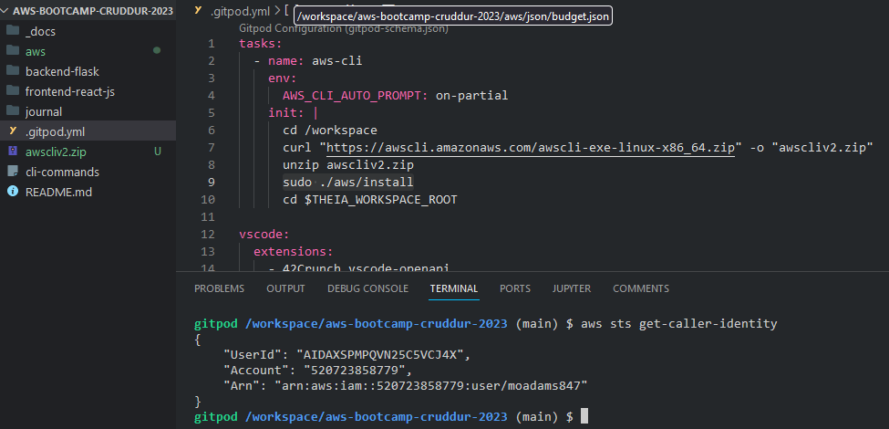
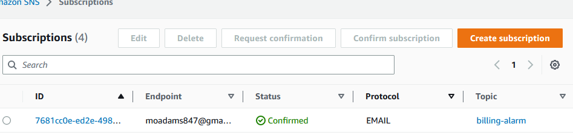
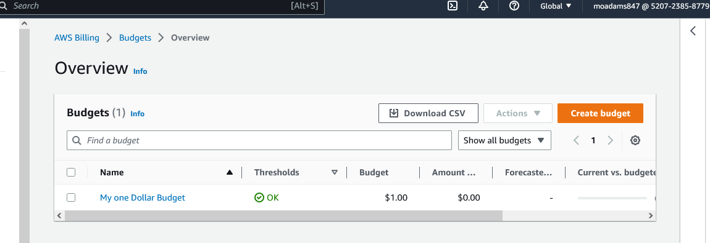
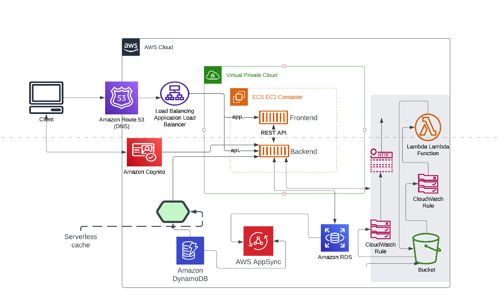

# Week 0 — Billing and Architecture

## Required Homework

### Install AWS CLI

I was able to install and then run aws CLI commands in gitpod.

I have successfully created an sns topic with the aws cli in gitpod

### Create SNS topic

.

### Create a Budget

### Recreate Logical Architecture Design

