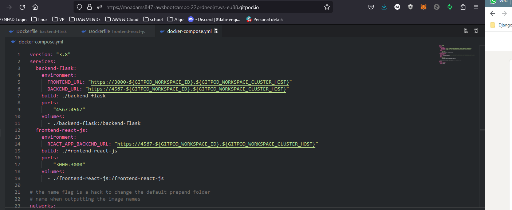
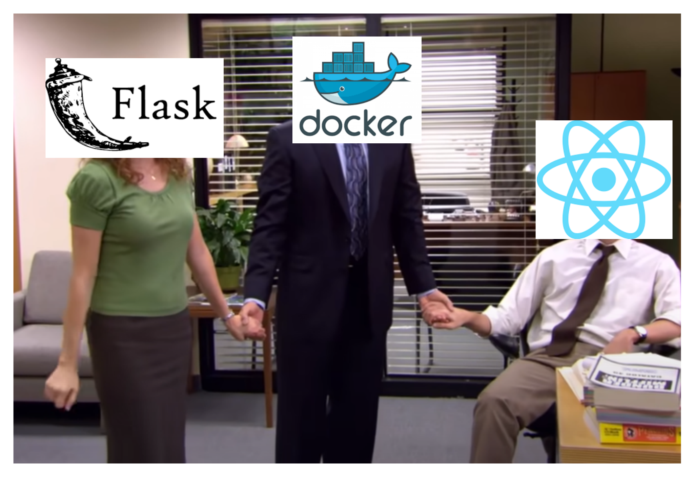

# Week 1 — App Containerization

Required Homework/Tasks

### Wrote a docker-compose file to get both the frontend and backend containers to runin tanden.

Challenge

### I wrote a medium blog on APP containerization

[How to Dockerize a React front-end app and a Flask back-end app](https://medium.com/@moadams847/how-to-dockerize-a-react-front-end-app-and-a-flask-back-end-app-ade92f351d59)

