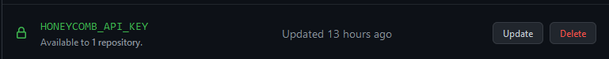
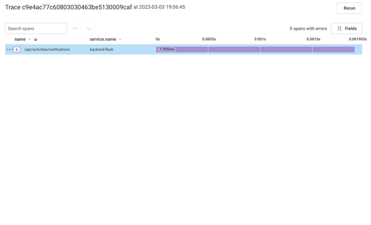
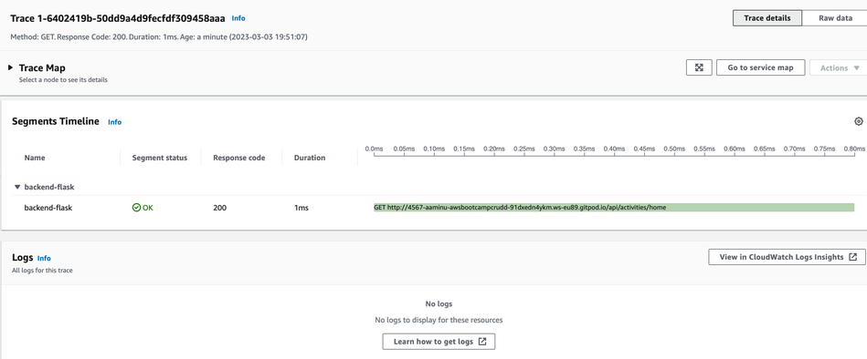

# Week 2 — Distributed Tracing

## **Required Homework**

### **Distrbuted Tracing with Honeycomb**
1. Created a trial account at [honeycomb.io](https://ui.honeycomb.io/)
2. Created a new enviroment and attained the api key
3. Saved the Api key to my Codespaces secrets



4. To ensure all dependencies(Open telemetry "OTEL") are met, thee following was added to the [requirements.txt](../backend-flask/requirements.txt) file:
    ```txt
    opentelemetry-api 
    opentelemetry-sdk 
    opentelemetry-exporter-otlp-proto-http 
    opentelemetry-instrumentation-flask 
    opentelemetry-instrumentation-requests
    ```
5. The [docker-compose.yml](../docker-compose.yml) file was also updated to reflect neccessary enivorment keys:
    ````yaml
    version: "3.8"
    services:
        backend-flask:
            environment:
                ...
                ...
                OTEL_SERVICE_NAME: "backend-flask"
                OTEL_EXPORTER_OTLP_ENDPOINT: "https://api.honeycomb.io"
                OTEL_EXPORTER_OTLP_HEADERS: "x-honeycomb-team=${HONEYCOMB_API_KEY}"
        ...
    ```

6. Next, to start getting traces in honeycomb, I added the following to the [app.py](../backend-flask/app.py):
    ```python
    ...
    ...

    # Honeycomb
    from opentelemetry import trace
    from opentelemetry.instrumentation.flask import FlaskInstrumentor
    from opentelemetry.instrumentation.requests import RequestsInstrumentor
    from opentelemetry.exporter.otlp.proto.http.trace_exporter import OTLPSpanExporter
    from opentelemetry.sdk.trace import TracerProvider
    from opentelemetry.sdk.trace.export import BatchSpanProcessor

    # Initialize tracing and an exporter that can send data to Honeycomb
    provider = TracerProvider()
    processor = BatchSpanProcessor(OTLPSpanExporter())
    provider.add_span_processor(processor)
    trace.set_tracer_provider(provider)
    tracer = trace.get_tracer(__name__)


    app = Flask(__name__)

    # Initialize automatic instrumentation with Flask
    FlaskInstrumentor().instrument_app(app)
    RequestsInstrumentor().instrument()
    ```
7. Finally, it was time to run ```docker compose up``` and see if traces are recieved in honeycomb.

8. Below is a proof of trace in honeycomb platform.
    


### **Distrbuted Tracing with AWS Xray**
1. To get started with aws-xray, the following was added to the [requirements.txt](../backend-flask/requirements.txt) file to ensure the necessary sdk was dowmnloaded:
    ```txt
    aws-xray-sdk
    ```
2. In the [docker-compose.yml](../docker-compose.yml) file, the following was added:
    ```yaml
    version: "3.8"
    services:
        backend-flask:
            environment:
                ...
                AWS_XRAY_URL: "*${CODESPACE_NAME}-4567.${GITHUB_CODESPACES_PORT_FORWARDING_DOMAIN}*"
                AWS_XRAY_DAEMON_ADDRESS: "xray-daemon:2000"
              
        ...
        xray-daemon:
            image: "amazon/aws-xray-daemon"
            environment:
                AWS_ACCESS_KEY_ID: "${AWS_ACCESS_KEY_ID}"
                AWS_SECRET_ACCESS_KEY: "${AWS_SECRET_ACCESS_KEY}"
                AWS_REGION: "us-east-1"
            command:
                - "xray -o -b xray-daemon:2000"
            ports:
                - 2000:2000/udp
    ```
3. The above sets the required enviroment variables and also defines the conntainer for the xray-daemon.
4. Next was to create a group on aws-xray to ensure we could group our traces. The following command as issued in the terminal since aws cli is already installed:
    ```bash
    $ aws xray create-group \
    --group-name "Cruddur" \
    --filter-expression "service(\"backend-flask\")"
    ```
5. The above should return a response with the arn and other parameters to indicate success
6. To create a samplinng rule for xray-services, a file was created in [aws-bootcamp-cruddur-2023/aws/json](../aws/json/) called [xray.json](../aws/json/xray.json) with content:
    ```json
    {
    "SamplingRule": {
        "RuleName": "Cruddur",
        "ResourceARN": "*",
        "Priority": 9000,
        "FixedRate": 0.1,
        "ReservoirSize": 5,
        "ServiceName": "backend-flask",
        "ServiceType": "*",
        "Host": "*",
        "HTTPMethod": "*",
        "URLPath": "*",
        "Version": 1
        }
    }
    ```
7. In the terminal, the following command was issued: 
    ```bash
    $ aws xray create-sampling-rule --cli-input-json file://aws/json/xray.json
    ```
8. In the [app.py](../backend-flask/app.py), the following was added:
    ```python
    ...
    ...

    # X_RAY
    from aws_xray_sdk.core import xray_recorder
    from aws_xray_sdk.ext.flask.middleware import XRayMiddleware

    xray_url = os.getenv("AWS_XRAY_URL")
    #xray_recorder.configure(service='backend-flask', dynamic_naming=xray_url)
    xray_recorder.configure(service='backend-flask') # To ensure all traces can be grouped under the Cruudr group created
    
    ......
    ......

    app = Flask(__name__)

    #XRAY
    XRayMiddleware(app, xray_recorder)
    ```
9. Started my containers and inspected aws xray in the aws console, please see evidence of traces in xray:
    
    

    Raw Output of the image above:
    ```json
    {
        "Id": "1-6402419b-50dd9a4d9fecfdf309458aaa",
        "Duration": 0.001,
        "LimitExceeded": false,
        "Segments": [
            {
                "Id": "eb5ca210c8961d0e",
                "Document": {
                    "id": "eb5ca210c8961d0e",
                    "name": "backend-flask",
                    "start_time": 1677869467.2860286,
                    "trace_id": "1-6402419b-50dd9a4d9fecfdf309458aaa",
                    "end_time": 1677869467.2867994,
                    "in_progress": false,
                    "http": {
                        "request": {
                            "url": "http://4567-moadamms847-awsbootcampcrudd-91dxedn4ykm.ws-eu89.codespaces.com/api/activities/home",
                            "method": "GET",
                            "user_agent": "curl/7.64.0",
                            "client_ip": "34.79.69.113",
                            "x_forwarded_for": true
                        },
                        "response": {
                            "status": 200,
                            "content_length": 1235
                        }
                    },
                    "aws": {
                        "xray": {
                            "sampling_rule_name": "Cruddur",
                            "sdk_version": "2.11.0",
                            "sdk": "X-Ray for Python"
                        }
                    },
                    "service": {
                        "runtime": "CPython",
                        "runtime_version": "3.10.10"
                    }
                }
            }
        ]
    }
    ```
